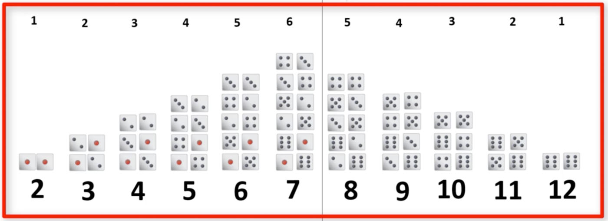
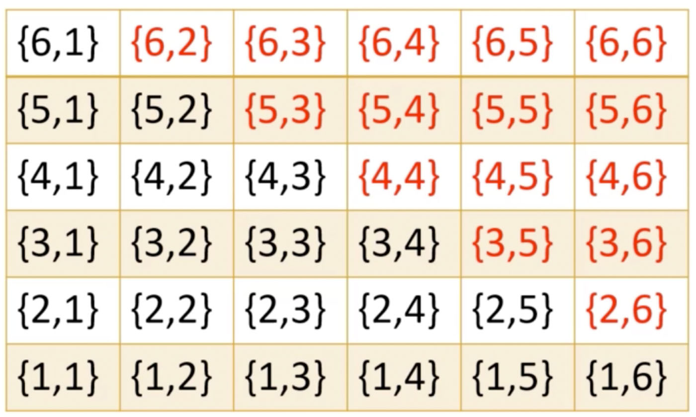

# Probability theory

Source: udemy.com 

Master the Probability and Statistics Concepts by Solving 100+ Problems (Video 5)

Instructor: Sandeep Kumar

### If 2 dice are rolled, what is the probability of gettig a sum of numbers greater than 7?

### Visually assisted solutions (Theoretical)




result = pairs to right of vertical line = 15

total pairs = 36

Probability of result > 7 = result / total pairs = 15/36 = 0.4167



result = red pairs = 15

total pairs = 36

Probability of result > 7 = result / total pairs = 15/36 = 0.4167

### Computer assisted solution with R

### Theoretical Result

```{r}
probability <- round((1+2+3+4+5) /36,4)
probability
```

### Experimental Results

```{r}
die <- c(1:6)
n <- 1000
seed = 112358
set.seed(seed)
one <- sample(die, size=n, replace=TRUE)
two <- sample(die, size=n, replace=TRUE)
Total <-  one+two
success <- ifelse(Total >7,1,0)
mean(success)
```

### Law of large numbers

The larger the number of trials, the closer the experimental proobability will be to the expected/theoretical value.

```{r}
n <- 10000
set.seed(seed)
one <- sample(die, size=n, replace=TRUE)
two <- sample(die, size=n, replace=TRUE)
Total <-  one+two
success <- ifelse(Total >7,1,0)
round(mean(success),4)
```

### Questions

1. At what age can a child be expected to understand the visually assisted analysis?

2. At what age can a child be expected to understand the computer assisted analysis?

### Let's experiment! The truth is out there! Can we find it?

```{r}
library(linguisticsdown)
library(htmlwidgets)
dice <- "dice.gif"
include_graphics2(dice)
```

Take care to only collect unbiased data. 

These dice must be loaded, since every toss results in"snake-eyes".

